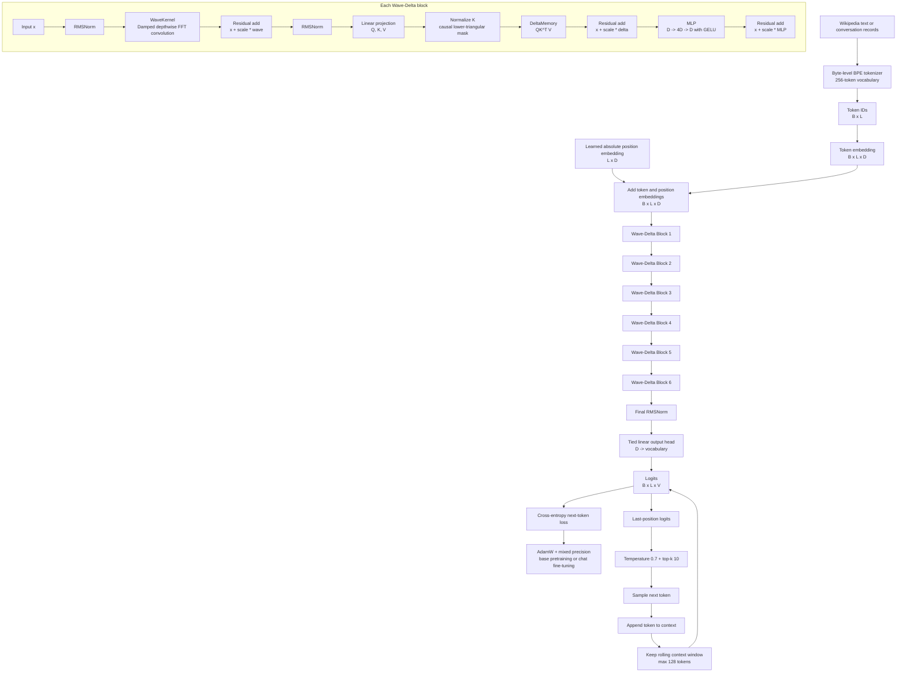

# Current Wave-Delta Chat Model Architecture

This document describes the implementation currently in `ark-chat`. It is based on the code copied from `wave_delta_transformer` and the design discussion in `chat/Building A Conservation-Based LLM.md`.

## System diagram



## Dimensions and configuration

The current configuration is:

| Symbol | Meaning | Current value |
|---|---|---:|
| $B$ | Batch size during base training | 64 |
| $L$ | Maximum sequence length | 128 |
| $D$ | Model width (`d_model`) | 256 |
| $N$ | Number of Wave-Delta blocks | 6 |
| $V$ | Vocabulary size | 256 in the config; the tokenizer state determines the runtime size |
| $r$ | MLP expansion ratio | 4 |

The model input is an integer tensor with shape $B \times L$. After embedding, the hidden state has shape $B \times L \times D$. The output head produces $B \times L \times V$ logits.

## Data and training path

### Tokenization

`data/tokenizer.py` starts with all 256 byte values and learns up to `vocab_size - 256` merges from UTF-8 text. The tokenizer stores its merge table and vocabulary in `data/bpe_state.pt`; encoded pretraining tokens are cached in `data/encoded_tokens.pt`.

This is a simple Python implementation intended for experimentation. It is not equivalent to a modern optimized tokenizer and does not use a separate end-of-turn token.

### Base pretraining

`scripts/train.py` reads `data/input.txt`, creates non-overlapping chunks of $L+1$ tokens, and trains next-token prediction:

$$
\mathcal{L} = -\frac{1}{BL}\sum_{b=1}^{B}\sum_{t=1}^{L}
\log p(x_{b,t}\mid x_{b,<t}).
$$

The base checkpoint is saved as `wave_delta_model.pt` after each epoch.

### Chat fine-tuning

`scripts/train_chat.py` accepts either a JSON array or JSONL file. Each record may use the compact form:

```json
{"user": "question", "assistant": "answer"}
```

or a multi-turn form:

```text
{"messages": [
    {"role": "system", "content": "..."},
    {"role": "user", "content": "question"},
    {"role": "assistant", "content": "answer"}
]}
```

It initializes from `wave_delta_model.pt` when available and saves the best validation checkpoint as `wave_delta_chat_model.pt`. Prompt and padding positions are masked with `-100`, so the loss is calculated only on assistant tokens. The default is three epochs at a low learning rate with gradient clipping and a deterministic validation split. Use `data/chat_train.example.jsonl` as the schema template and provide a real dataset with `--data` or `CHAT_DATA_PATH`.

## WaveKernel: conserved/damped signal path

For each feature channel, the kernel is parameterized as:

$$
k_d(t) = e^{-\alpha_d t}\cos(\omega_d t + \phi_d).
$$

The code computes the input and kernel FFTs, multiplies them channel-wise, and applies an inverse FFT. It uses zero-padding to:

$$
n_{fft}=2^{\lceil\log_2(2L)\rceil}.
$$

The damping parameter $\alpha$ makes the learned response decay over time. The implementation is a depthwise channel-wise convolution; it does not enforce a formal physical conservation law such as an exactly conserved energy or norm.

## DeltaMemory: current causal retrieval path

The module projects the normalized hidden state into $Q$, $K$, and $V$:

$$
[Q,K,V] = XW_{qkv}.
$$

Keys are normalized, then the module computes:

$$
A = QK^T,
\qquad
A_{ij}=0\ \text{for}\ j>i,
\qquad
Y=AV.
$$

The causal mask prevents a token from using future tokens. However, this current implementation materializes an attention-score tensor with shape $B \times L \times L$ and is therefore not linear-time. It is an $L \times L$ formulation chosen to use less memory than the earlier $D \times D$ state formulation when $L<D$.

## Complexity

Let $N$ be the number of blocks.

| Component | Time per block | Main activation memory |
|---|---:|---:|
| RMSNorm | $O(LD)$ | $O(LD)$ |
| WaveKernel FFT path | $O(DL\log L)$ | $O(DL)$ to $O(Dn_{fft})$ |
| QKV projection | $O(LD^2)$ | $O(LD)$ |
| Causal DeltaMemory | $O(L^2D)$ | $O(L^2 + LD)$ |
| MLP | $O(LD^2)$ | $O(LD)$ plus training intermediates |
| Output projection | $O(LDV)$ | $O(LV)$ for logits |

For the full forward pass, the current dominant asymptotic terms are approximately:

$$
O\left(N\left(DL\log L + L^2D + LD^2\right) + LDV\right).
$$

With $L=128$ and $D=256$, the current delta path is not $O(L)$ or purely $O(L\log L)$: it is $O(L^2D)$. The wave component is $O(DL\log L)$, but the total architecture is governed by all components together.

### Training

Training has the same forward asymptotic cost plus backward-pass work and saved activations. Mixed precision is enabled in `scripts/train.py`, but the chat fine-tuning script currently uses ordinary precision.

### Generation latency

The chat interface samples one token at a time. It reruns the complete model on the rolling context for every generated token, so generating $T$ tokens costs approximately:

$$
O\left(T\left[N(DL\log L + L^2D + LD^2) + LDV\right]\right).
$$

There is currently no wave-state cache or delta-state cache. The context is truncated to at most 128 tokens to stay within the learned absolute position embedding.

## Inference controls

The current chat loop:

1. Loads `wave_delta_chat_model.pt`, falling back to `wave_delta_model.pt`.
2. Maintains text history beginning with a system instruction.
3. Truncates the encoded context to leave generation room.
4. Recomputes logits for the full rolling window.
5. Divides logits by temperature `0.7`.
6. Restricts sampling to the top 10 tokens.
7. Stops on a newline or generated `User:` marker, or after 100 tokens.

## Current limitations shown by the architecture

- The fallback chat dataset is intentionally tiny; meaningful quality requires replacing it with a diverse dataset such as the supplied JSONL template expanded to many examples.
- The tokenizer is byte-based and small, which produces longer sequences than modern subword tokenizers.
- Absolute positional embeddings cap the supported context at 128 tokens.
- DeltaMemory is causal but currently quadratic in sequence length because it materializes $QK^T$.
- Autoregressive generation recomputes the full context on every step.
- No validation split, perplexity evaluation, held-out chat set, or benchmark harness is included.
- The wave layer is an efficient learned signal filter, but the code does not yet prove an exact conservation invariant.

## What this model is

The current system is a small decoder-only language model with six repeated blocks. Each block combines:

1. A damped frequency-domain signal-mixing path.
2. A causal masked content-retrieval path.
3. A conventional feed-forward expansion.
4. Residual connections and RMS normalization.

Its research claim should currently be evaluated as a hybrid wave-plus-causal-retrieval architecture, not as a complete $O(L\log L)$ replacement for transformer attention.