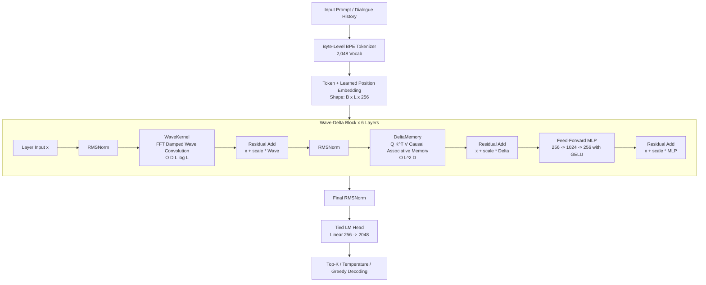

# Ark-Chat: Conservation-Based Wave-Delta Language Model

[](https://www.python.org/)
[](https://pytorch.org/)
[](LICENSE)
[%20Compatible-green.svg)](https://www.nvidia.com/)

**Ark-Chat** is a lightweight, from-scratch conversational language model that explores a hybrid physical wave equation and causal associative memory architecture as an alternative to quadratic softmax attention.

Designed specifically to research sub-quadratic sequence mixing and low-memory training on consumer hardware (such as an NVIDIA GTX 1650 4GB GPU), Ark-Chat combines:
1. **WaveKernel**: Frequency-domain continuous wave propagation ($O(L \log L)$ sequence mixing via Fast Fourier Transforms).
2. **Causal Delta Memory**: A low-memory associative recall mechanism with causal masking.
3. **Subword BPE Tokenization**: A high-throughput 2,048-vocabulary Byte-Level BPE tokenizer.
4. **End-to-End Instruction Fine-Tuning**: A supervised training pipeline with assistant-only loss masking and validation checkpointing.

---

## Architecture Overview



### 1. The Damped Wave Kernel ($O(L \log L)$)
Instead of computing an $L \times L$ attention matrix for sequence mixing, the WaveKernel treats hidden features as continuous spatial-temporal waves governed by a damped wave equation:

$$k_d(t) = e^{-\alpha_d t} \cos(\omega_d t + \phi_d)$$

- $\alpha_d$: Learnable damping rate ensuring numerical stability.
- $\omega_d$: Learnable oscillation frequency across channels.
- $\phi_d$: Initial phase shift.

The layer computes sequence-wide convolution in the frequency domain via Real Fast Fourier Transforms (`torch.fft.rfft`), achieving global receptive field coverage in $O(D \cdot L \log L)$ time.

### 2. Causal Delta Memory ($O(L^2 D)$)
To enable associative recall, the model projects states into queries, keys, and values ($Q, K, V$). Keys are normalized, and a causal lower-triangular mask ensures no token accesses future information:

$$A = \text{tril}(Q K^T), \quad Y = A V$$

By computing the $L \times L$ causal formulation when sequence length ($L=128$) is smaller than feature dimension ($D=256$), the implementation avoids $D \times D$ autograd state explosion, keeping VRAM usage negligible on 4GB GPUs.

---

## Model Specifications

| Parameter | Configuration Value | Description |
|---|---|---|
| **Model Dimension ($D$)** | `256` | Hidden dimension across all blocks |
| **Number of Layers ($N$)** | `6` | Repeated Wave-Delta transformer blocks |
| **Vocabulary Size ($V$)** | `2,048` | Subword BPE tokens |
| **Sequence Length ($L$)** | `128` | Maximum sequence context window |
| **MLP Expansion ($r$)** | `4x` (1,024 dim) | Feed-forward intermediate dimension |
| **Weight Tying** | Enabled | Input embedding and output projection share weights |
| **Total Parameters** | **4,894,982 (~4.89M)** | Full trainable parameter count |

---

## Project Structure

```
ark-chat/
├── ARCHITECTURE.md              # Detailed technical specification and complexity analysis
├── README.md                    # Project documentation and guide
├── requirements.txt             # Environment dependencies
├── wave_delta_model.pt          # Pre-trained base language model weights
├── wave_delta_chat_model.pt     # Fine-tuned conversational model weights
│
├── configs/
│   └── base_config.yaml         # Model hyper-parameters and training configuration
│
├── data/
│   ├── tokenizer.py             # Byte-Level BPE tokenizer implementation
│   ├── input.txt                # Raw Wikitext-2 pretraining corpus (10.5 MB)
│   ├── bpe_state.pt             # Cached vocabulary and merge state
│   ├── encoded_tokens.pt        # Pre-encoded token dataset (3.45M tokens)
│   ├── chat_train.jsonl         # Curated multi-turn instruction dataset
│   └── chat_train.example.jsonl # Template schema for dataset expansion
│
├── models/
│   ├── transformer.py           # WaveDeltaTransformer & WaveDeltaBlock definitions
│   └── layers/
│       ├── wave_kernel.py       # Frequency-domain FFT wave convolution
│       ├── delta_memory.py      # Causal low-memory associative recall
│       └── norm.py              # Root Mean Square Normalization (RMSNorm)
│
├── scripts/
│   ├── prepare_wiki.py          # Downloads and sanitizes Wikitext-2 corpus
│   ├── prepare_chat_data.py     # Downloads and converts instruction datasets
│   ├── train.py                 # Self-supervised base language model pretraining
│   ├── train_chat.py            # Supervised conversational fine-tuning
│   └── chat_interface.py       # Interactive terminal chat CLI
│
└── utils/
    ├── logger.py                # Logging utilities
    └── physics_diag.py          # Wave kernel diagnostic and scaling benchmark tools
```

---

## Quick Start

### 1. Installation

Clone the repository and set up a Python virtual environment:

```bash
git clone https://github.com/your-username/ark-chat.git
cd ark-chat

python -m venv .venv
source .venv/bin/activate
pip install -r requirements.txt
```

### 2. Pre-Training the Base Model

Download the clean Wikipedia subset (Wikitext-2) and train the base model:

```bash
# 1. Download and sanitize Wikitext-2 corpus
python scripts/prepare_wiki.py

# 2. Train the base language model
python scripts/train.py
```

*Training takes ~25 seconds per epoch on an NVIDIA GTX 1650 (421 batches/epoch at batch size 64).*

### 3. Instruction Fine-Tuning

Fine-tune the pre-trained base model into a conversational assistant using supervised question-answering data:

```bash
python scripts/train_chat.py \
  --data data/chat_train.jsonl \
  --epochs 10 \
  --learning-rate 1e-4 \
  --batch-size 4 \
  --save-mode val_loss \
  --patience 2
```

**Key Fine-Tuning Features:**
- **Assistant-Only Loss Masking**: User prompts and padding tokens are masked with `-100`, optimizing gradients exclusively on assistant responses.
- **Validation-Based Early Stopping**: Automatically stops if validation loss ceases improving to prevent catastrophic forgetting.
- **Multi-Format Ingestion**: Supports OpenAI `messages`, ShareGPT (`conversations`), and Alpaca (`instruction` + `output`) schemas.

### 4. Interactive Chat

Launch the interactive chat interface in your terminal:

```bash
# Deterministic greedy decoding
python scripts/chat_interface.py --greedy

# Creative sampling with temperature and Top-K filtering
python scripts/chat_interface.py --temperature 0.3 --top-k 5
```

---

## Algorithmic Complexity

| Architecture Component | Training Complexity (Parallel) | Inference Latency (per Token) | Working State Memory |
|---|---|---|---|
| **RMSNorm** | $O(L \cdot D)$ | $O(D)$ | None |
| **WaveKernel (SSM Dual)** | $O(D \cdot L \log L)$ | **$O(D)$** | $2D$ floats (complex state $h_t$) |
| **DeltaMemory (Chunked)** | **$O(L \cdot C \cdot D + \frac{L}{C} D^2)$** | **$O(D^2)$** | $D^2$ floats (matrix state $S_t$) |
| **Feed-Forward MLP** | $O(L \cdot D^2)$ | $O(D^2)$ | None |
| **Total Block Pass** | **$\mathcal{O}(L \log L)$ sub-quadratic** | **$\mathcal{O}(1)$ constant time** | Low VRAM (~1.2 GB total) |

Unlike standard Transformers that require $O(L \cdot D)$ KV-cache computation per token at inference time, Ark-Chat generates tokens in strictly **$O(1)$ constant time** via its dual state-space recurrent cache.

---

## Customizing Instruction Data

You can add custom domain conversations to `data/chat_train.jsonl` using the standard multi-turn schema:

```json
{"messages": [
  {"role": "system", "content": "You are a concise scientific assistant."},
  {"role": "user", "content": "What is the speed of light in a vacuum?"},
  {"role": "assistant", "content": "The speed of light in a vacuum is approximately 299,792,458 meters per second."}
]}
```

Or convert open instruction datasets automatically:

```bash
python scripts/prepare_chat_data.py
```

---

## License

This project is licensed under the MIT License — see the LICENSE file for details.

