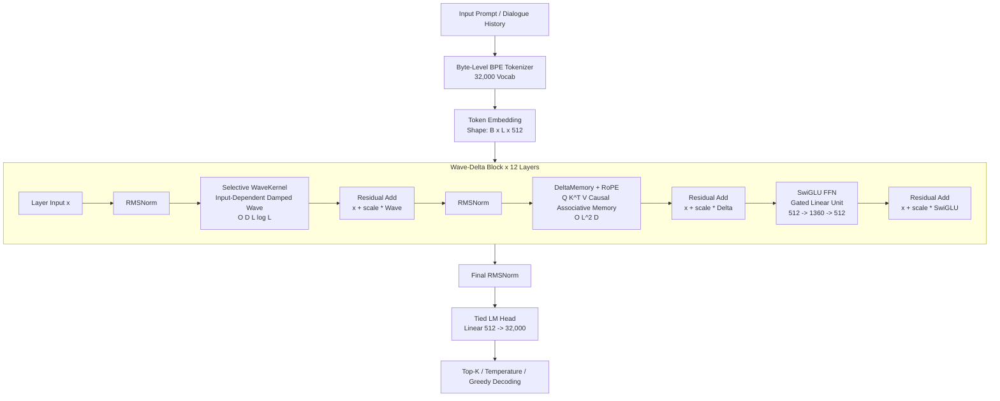

# Ark-Chat: Conservation-Based Wave-Delta Language Model

[](https://www.python.org/)
[](https://pytorch.org/)
[](LICENSE)
[](https://www.nvidia.com/)

**Ark-Chat** is a lightweight, from-scratch conversational language model that explores a hybrid physical wave equation and causal associative memory architecture as an alternative to quadratic softmax attention.

Originally designed for a 4GB GTX 1650, the architecture has been scaled and optimized to fully utilize a 16GB Google Colab T4 GPU (up to ~62M parameters), featuring **Chain-of-Thought (CoT) reasoning**, **Live Web Reading**, and **PyTorch 2.0 Compilation optimizations**.

---

## Architecture Overview (v2.0)


```mermaid
flowchart TD
    In[Input Prompt / Dialogue History] --> Tok[Byte-Level BPE Tokenizer\n32,000 Vocab]
    Tok --> Emb[Token Embedding\nShape: B x L x 512]
    
    subgraph Core[Wave-Delta Block x 12 Layers]
        X0[Layer Input x] --> N1[RMSNorm]
        N1 --> Wave[Selective WaveKernel\nInput-Dependent Damped Wave\nO D L log L]
        Wave --> Res1[Residual Add\nx + scale * Wave]
        Res1 --> N2[RMSNorm]
        N2 --> Delta[DeltaMemory + RoPE\nQ K^T V Causal Associative Memory\nO L^2 D]
        Delta --> Res2[Residual Add\nx + scale * Delta]
        Res2 --> MLP[SwiGLU FFN\nGated Linear Unit\n512 -> 1360 -> 512]
        MLP --> Res3[Residual Add\nx + scale * SwiGLU]
    end
    
    Emb --> Core
    Core --> OutNorm[Final RMSNorm]
    OutNorm --> Head[Tied LM Head\nLinear 512 -> 32,000]
    Head --> Gen[Top-K / Temperature / Greedy Decoding]
```

### 1. Selective Damped Wave Kernel (Mamba-Inspired)
Instead of computing an $L \times L$ attention matrix, the WaveKernel treats hidden features as continuous spatial-temporal waves governed by a damped wave equation. 
**New in v2.0:** The decay rate is now dynamically modulated by the input (Selective Gating), allowing the model to selectively remember or forget information across the sequence:
$$k_d(t) = e^{-\alpha_d(x) t} \cos(\omega_d t + \phi_d)$$
The layer computes sequence-wide convolution via Real Fast Fourier Transforms (`torch.fft.rfft`), achieving global receptive field coverage in $O(D \cdot L \log L)$ time.

### 2. Causal Delta Memory + RoPE
To enable associative recall, the model projects states into queries, keys, and values. **New in v2.0:** Rotary Position Embeddings (RoPE) are applied to Q and K, granting the model relative position awareness without fixed positional embeddings.
$$A = \text{tril}(\text{RoPE}(Q) \text{RoPE}(K)^T), \quad Y = A V$$

### 3. SwiGLU FFN
The standard GELU Feed-Forward Network has been replaced with a Llama-style Gated Linear Unit (SwiGLU) for superior gradient flow.

---

## Model Specifications

| Parameter | GTX 1650 (Local) | Colab T4 (Scaled) | Description |
|---|---|---|---|
| **Model Dimension ($D$)** | `256` | `512` | Hidden dimension across all blocks |
| **Number of Layers ($N$)** | `6` | `12` | Repeated Wave-Delta blocks |
| **Attention Heads ($H$)** | `4` | `8` | Multi-head dimension division |
| **Vocabulary Size ($V$)** | `8,192` | `32,000` | Subword BPE tokens |
| **Context Window ($L$)** | `512` | `2,048` | Maximum sequence context window |
| **Total Parameters** | **7.77M** | **61.56M** | Full trainable parameter count |

---

## New Features

### 🧠 Chain-of-Thought (CoT) Reasoning
The data pipeline (`prepare_colab_data.py`) now synthesizes and downloads high-quality CoT data, including:
- Synthetic step-by-step arithmetic (addition, multiplication, word problems)
- Logical syllogisms and if-then deductions
- MetaMathQA reasoning datasets
The chat interface automatically formats `<think> ... </think>` blocks in dim gray text in your terminal to visualize the model's reasoning process!

### 🌐 Live Web Reading
You can now paste web URLs directly into the chat interface! The model will fetch the live HTML, strip out the noise, and inject the clean text directly into the 2,048-token context window so it can answer questions based on live websites.

---

## Google Colab T4 Training (Recommended)

To fully train the 62M parameter model on a free Google Colab T4 GPU:

1. Open Google Colab, create a new notebook, and set Runtime to **T4 GPU**.
2. Run the setup cell:
```python
!git clone https://github.com/YOUR_USERNAME/ark-chat.git
%cd ark-chat
!pip install -q torch pyyaml pandas tokenizers datasets
```
3. Run the automated training pipeline (takes ~5-6 hours):
```python
!python scripts/colab_train.py --all
```
4. Download the resulting `wave_delta_chat_model_colab.pt`, `data/colab_bpe_state.pt`, and `configs/colab_config.yaml` to run locally!

---

## Local Development (GTX 1650 / 4GB VRAM)

### 1. Installation
```bash
git clone https://github.com/YOUR_USERNAME/ark-chat.git
cd ark-chat
python -m venv .venv
source .venv/bin/activate
pip install -r requirements.txt
```

### 2. Pre-Training & Fine-Tuning
```bash
# 1. Train the base language model
python scripts/train.py

# 2. Fine-tune on conversational instruction data
python scripts/train_chat.py \
  --data data/chat_train.jsonl \
  --epochs 10 --batch-size 4 --save-mode val_loss
```

### 3. Interactive Chat
Launch the interactive chat interface (supports web URLs in your prompt!):
```bash
python scripts/chat_interface.py --temperature 0.3 --top-k 10
```

---

## Algorithmic Complexity

| Architecture Component | Training Complexity (Parallel) | Inference Latency (per Token) |
|---|---|---|
| **Selective WaveKernel** | $O(D \cdot L \log L)$ | **$O(D)$** |
| **DeltaMemory + RoPE** | $O(L \cdot C \cdot D + \frac{L}{C} D^2)$ | **$O(D^2)$** |
| **Total Block Pass** | **$\mathcal{O}(L \log L)$ sub-quadratic** | **$\mathcal{O}(1)$ constant time** |

Unlike standard Transformers that require $O(L \cdot D)$ KV-cache computation per token at inference time, Ark-Chat generates tokens in strictly **$O(1)$ constant time** via its dual state-space recurrent cache.

---

## License

This project is licensed under the MIT License — see the LICENSE file for details.
